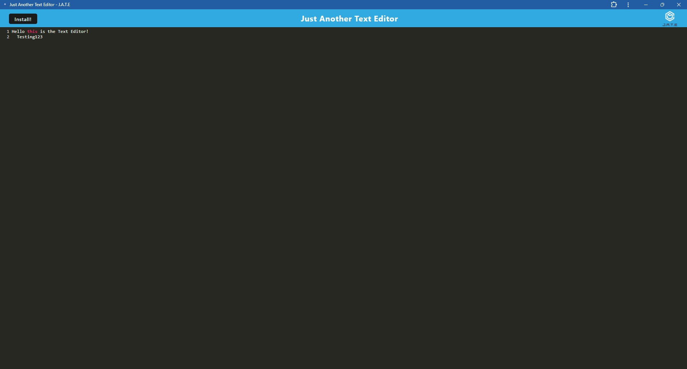

# PWA-Text-Editor

# Table of Contents
- [User Story](#user-story)
- [Description](#description)
- [Challenges](#challenges)
- [Installation](#installation)
- [Link to Deployed Website](#deployed-application)
- [Screenshots](#screenshots)
- [Questions](#questions)

# User Story
AS A developer
I WANT to create notes or code snippets with or without an internet connection
SO THAT I can reliably retrieve them for later use

# Description
This project creates a text editor web application.  When a user runs 'npm run start' the application should start up the backend and serve the client.  When the project is ran from the terminal, the Javascript files will be bundled using webpack.  The project will also generate a HTML file, service worker, and a manifest file.

# Challenges 
The biggest challenge I faced when working on this project was deploying the site live.  

# Installation 
Run "npm i" or "npm install" to install the necessary packages needed to run the program.  
Run "npm start" to deploy the program.

# Deployed Application
[Deployed Application](https://pwa-text-editor-pkvg.onrender.com)

# Screenshots

# Questions
Github Profile?
[Link to Github](https://www.github.com/EmmanuelJatto)
How can you reach me?
emmanueljatto33@gmail.com